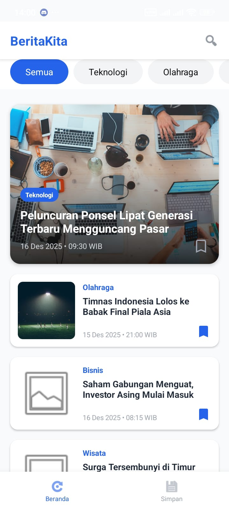
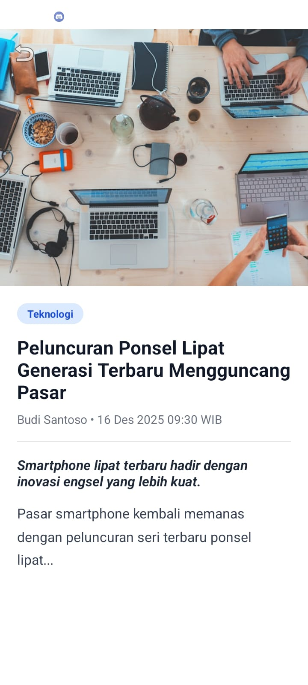
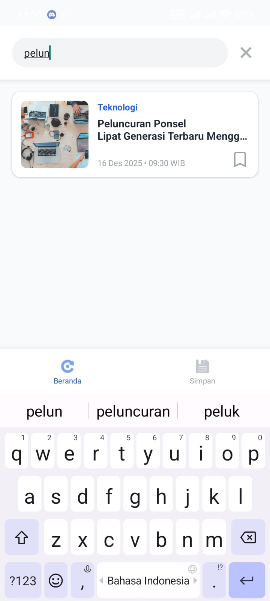
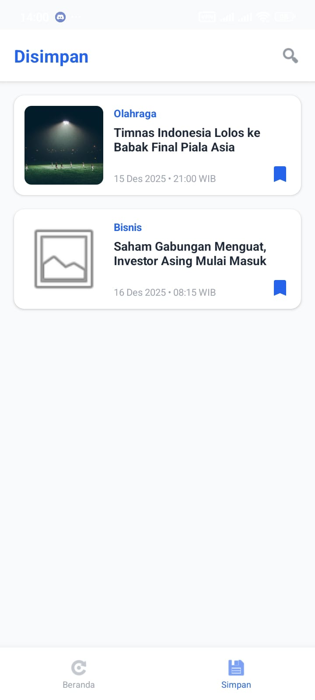

# Berita Kita 📰

**Berita Kita** adalah aplikasi berita Android sederhana dan modern yang dibangun menggunakan Kotlin. Aplikasi ini memungkinkan pengguna untuk membaca berita terkini, memfilter berdasarkan kategori, mencari topik tertentu, dan menyimpan artikel favorit mereka untuk dibaca nanti.

## 📱 Fitur Utama

* **Beranda & Headline:** Menampilkan berita utama (headline) dan daftar berita terbaru secara rapi.
* **Kategori Berita:** Filter berita dengan mudah berdasarkan kategori: *Teknologi, Olahraga, Bisnis, dan Wisata*.
* **Pencarian Cepat:** Fitur pencarian untuk menemukan berita berdasarkan judul atau isi ringkasan.
* **Detail Berita:** Tampilan baca yang nyaman dengan gambar, penulis, dan konten lengkap.
* **Bookmark (Simpan):** Fitur untuk menyimpan berita ke daftar "Disimpan" (menggunakan penyimpanan lokal).
* **Splash Screen:** Animasi pembuka yang elegan saat aplikasi dimulai.

## 📸 Screenshots Aplikasi

Berikut adalah tampilan antarmuka dari aplikasi Berita Kita:

| Halaman Beranda | Detail Berita |
| :---: | :---: |
|  |  |
| **Tampilan Headline & List** | **Tampilan Baca Berita** |

| Fitur Pencarian | Halaman Bookmark |
| :---: | :---: |
|  |  |
| **Mencari Berita** | **Daftar Berita Disimpan** |

> **Catatan untuk Pengembang:**
> Agar gambar di atas muncul, silakan buat folder baru bernama `screenshots` di dalam folder root proyek ini. Kemudian, ambil screenshot aplikasi Anda, beri nama file sesuai (misal: `home_screen.png`), dan masukkan ke dalam folder tersebut.

## 🛠️ Teknologi & Library

Aplikasi ini dibangun dengan standar pengembangan Android modern:

* **Bahasa:** [Kotlin](https://kotlinlang.org/)
* **Minimum SDK:** Android 7.0 (API 24)
* **Target SDK:** Android 15 (API 35/36)
* **UI Toolkit:** XML Layouts dengan **ViewBinding**.
* **Komponen Utama:**
    * `RecyclerView` - Untuk menampilkan daftar berita.
    * `CardView` & `Material Components` - Untuk desain antarmuka yang modern.
    * `SharedPreferences` - Untuk menyimpan data bookmark secara lokal.
* **Library Pihak Ketiga:**
    * [Glide](https://github.com/bumptech/glide) - Untuk memuat dan menampilkan gambar dari URL.
    * [Gson](https://github.com/google/gson) - Untuk parsing data berita dari format JSON (`news_data.json`).

## 📂 Struktur Data

Aplikasi ini menggunakan data lokal (mock data) yang tersimpan dalam file JSON untuk simulasi berita.
* Lokasi file: `app/src/main/assets/news_data.json`

## 🚀 Cara Menjalankan Project

1.  **Clone** repository ini atau unduh file ZIP.
2.  Buka **Android Studio**.
3.  Pilih **Open an Existing Project** dan arahkan ke folder proyek ini.
4.  Tunggu proses **Gradle Sync** selesai.
5.  Jalankan aplikasi (Run 'app') pada Emulator atau Perangkat Android fisik Anda.

---
Dikembangkan dengan ❤️ menggunakan Kotlin.
